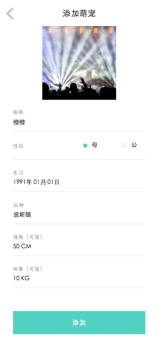
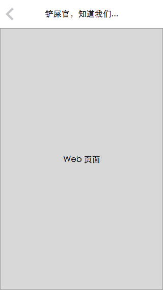

# 设计简介

这是第一版的初始设计，完成于 2015.08.21。

注意：引导页面、关于页面和 Logo、ICON 以及启动页面还没做，这些最后再来。

## 用户部分

初始界面为用户登录，忘记密码的话就弹窗。

注册要求 用户名、密码、密保问题和密保答案，密保问题具有选择范围，密保答案自己填。

个人信息更改即时保存，修改密码的弹窗和忘记密码款式一致。

## 导航

导航分为两个部分，一个是固定导航项目，一个是非固定导航项目。

固定导航项目为：

* 我的萌宠 -- 萌宠列表
* 汪汪喵喵 -- 消息列表
* 个人信息
* 退出登录
* 关于萌宠日记.x

非固定导航项目在固定导航项目上方，以横线分割，显示为宠物的昵称。有几只已登记宠物就有几个导航项目。

## 宠物列表

这是宠物列表和添加编辑宠物信息。

## 日记和大事录

日记和大事录形式一致，以“是否是大事”来筛选显示（绿色圈为普通事件），每条日记类似微信朋友圈，可以有标题+内容+图片。

添加和编辑日记页面基本一致。

## 消息

消息列表，绿色为已读消息。

消息内容展示为 Web 页面。

## 相册

强烈建议暂时去掉这个功能，让用户利用系统的相册，着重使用日记功能就好。

因为：

* 这个功能完全不重要，或者其实已经包含在日记系统里了，君不见微信朋友圈也是没有相册的
* 仓促的设计和制作只能导致比系统相册差非常多的相册系统，不如不做

不过还是把图贴上吧，我差不多画完了才觉得这个东西应该删掉的

